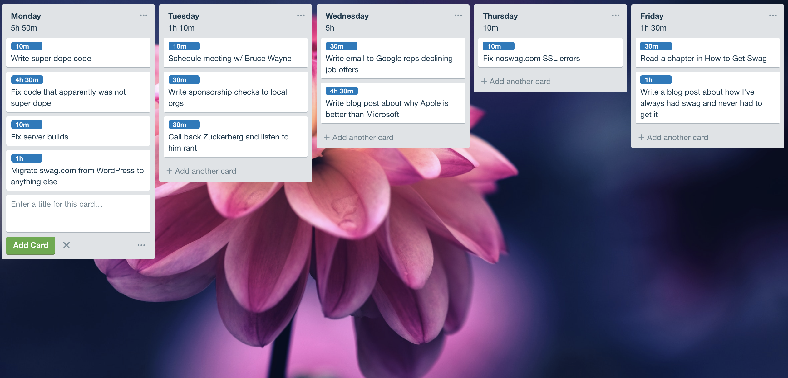

# Trello List Label Time Totals

Add labels with time durations for each card on a given list and the total will be displayed at the top. I find this particularly helpful as I have a list of tasks for each day of the week and I often over-commit the free time I don't have.

## Installation

1. Git clone this repository.
2. Go to "Extensions" in Google Chrome
3. Turn on "Developer Mode"
4. Click on "Load Unpacked"
5. Load the director of this repository on your local machine

## Configuration

- Create labels with time increments as the text. eg. ("2h 30m", "60 minutes", etc )
- For all cards on that list with a time label, the total expected time will be calculated and added to the top of the list
